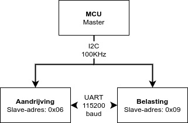
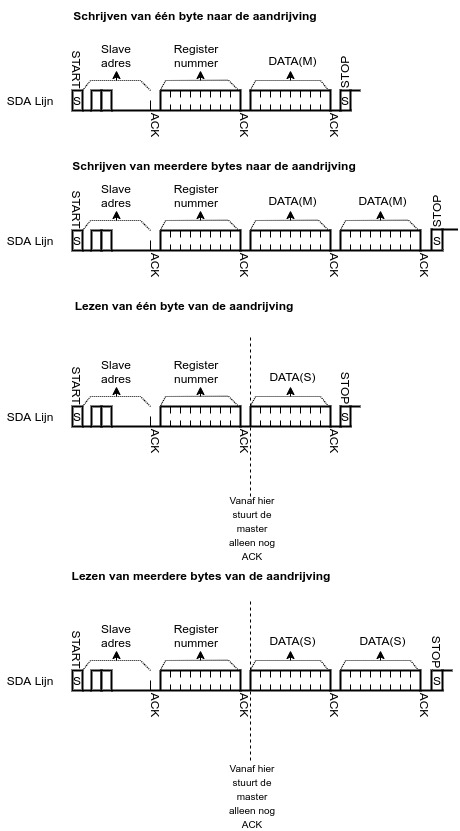
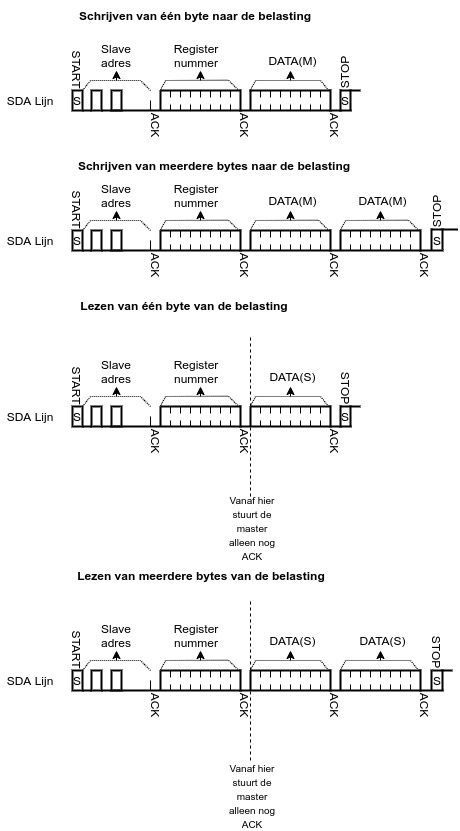

#Afspraken datacommunicatie

##Verbindingsinstellingen:

###I2C:
Bussnelheid: 100KHz

Adresseermodus: 7-bit

Hoeveelheid data die verstuurd kan worden per schrijf-cycle: 8 bits

Hoeveelheid data die ontvangen kan worden per lees-cycle: 8 bits

Spanning: 3.3V

&nbsp;

###UART:
Baudrate: 115200 baud

Communicatie: Half-duplex

Spanning: 3.3V

&nbsp;

Datacommunicatie diagram

&nbsp;

???+1 note "Hoe ziet een transactie op een I2C bus eruit"
    ##MCU naar de aandrijving
    
    
    ##MCU naar de belasting
    

???+1 note "Hoe ziet de datacommunicatie over UART eruit"

